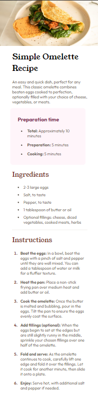
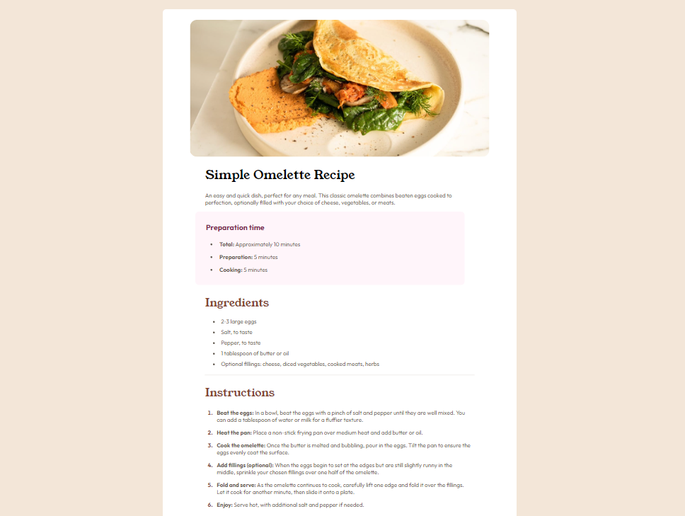

# Frontend Mentor - Recipe page solution

This is a solution to the [Recipe page challenge on Frontend Mentor](https://www.frontendmentor.io/challenges/recipe-page-KiTsR8QQKm). Frontend Mentor challenges help you improve your coding skills by building realistic projects.

## Table of contents

- [Overview](#overview)
  - [The challenge](#the-challenge)
  - [Screenshot](#screenshot)
  - [Links](#links)
- [My process](#my-process)
  - [Built with](#built-with)
  - [What I learned](#what-i-learned)
- [Author](#author)
- [Acknowledgments](#acknowledgments)

## Overview

This is my second project since completing my internship with Indigenous Friends Association. The website 'frontendmentor.io' was suggested to me by one of my web developer mentors so that I can continue to solidify concepts and gain practice while building projects that are portfolio ready.

This project is categorized under the "newbie" challenge section. It needs to be responsive and includes a style guide, assets folder, and screenshots of what the final designs should look like.

## The challenge

The challenge is to build out a recipe page and get it looking as close to the design as possible. This challenge requires basic understanding of HTML and CSS.

### Screenshot

### Links

- Solution URL: [github repository](https://github.com/roguemacaroon/deploy-recipe-challenge)
- Live Site URL: [github pages live solution](https://roguemacaroon.github.io/deploy-recipe-challenge/)

## My process
After carefully reviewing the designs, I started by creating my known variables in CSS and added in my normalize file. 
Then I began to sort through the index to map out where everything was going to need to go, classing accordingly. 
I started with a mobile first design and built up from there.

Getting wrappers in place was my first task. It makes things easier for me to have a wrapper applied from the beginning and adjust as needed. 
The last portion to get into place was the nutrition facts. I did not match the spacing of the nutrition facts exactly to the design, and my original design had the nutrition facts centered with a margin: 0 auto;. I liked the look of it better, but chose to try and stay as true to the design as possible.  

### Built with

- Semantic HTML5 markup
- CSS custom properties
- Flexbox
- CSS Grid
- Mobile-first workflow

### What I learned
It may be worthwhile checking out grid/tables for sections like nutrition facts. 

## Author

- Website - [trishcodes.dev](https://www.trishcodes.dev)
- Frontend Mentor - [@roguemacaroon](https://www.frontendmentor.io/profile/roguemacaroon)
- Github - [@roguemacaroon](https://github.com/roguemacaroon)

## Acknowledgments

Thank you to frontendmentor.io for this challenge.
Thank you to my own mentors for supporting me through my journey. I would not be here without you!

